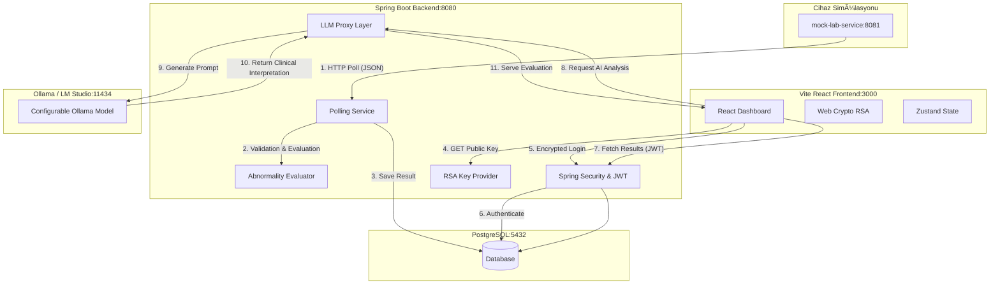

# Lab Sonuçları Akıllı Asistan (Lab Results Smart Assistant)

Bu proje, bir hastanede laboratuvar cihazlarından gelen test sonuçlarını işleyen, doğrulayan, hekimlerin görüntülemesine sunan ve yapay zeka destekli (Ollama) klinik yorum ve ön analiz sağlayan modern bir web uygulamasıdır.

---

## Mimari Yapı ve Akış Diyagramı

Sistemin bileşenleri arasındaki veri akışını gösteren mimari şema aşağıdadır:



---

## Hızlı Başlangıç (Docker Compose ile Kurulum)

### Gereksinimler
- Bilgisayarınızda **Docker** ve **Docker Compose** kurulu olmalıdır.
- Yapay zeka yorumları için lokalde **Ollama** yüklü olmalı ve `.env` içindeki `OLLAMA_MODEL` değerine karşılık gelen model indirilmiş olmalıdır. Varsayılan tercih `qwen2.5:14b` olarak ayarlanmıştır.

### Adım Adım Kurulum

1. **Repoyu Klonlayın veya Proje Dizinine Gidin:**
   ```bash
   cd lab-assistant
   ```

2. **Çevre Değişkenlerini Ayarlayın:**
   `.env.example` dosyasını `.env` olarak kopyalayın:
   ```bash
   cp .env.example .env
   ```
   *(Windows için `copy .env.example .env`)*

3. **Ollama Modelini Hazırlayın:**
   Bilgisayarınızda Ollama'nın çalıştığından ve `OLLAMA_MODEL` değerindeki modelin kurulu olduğundan emin olun:
   ```bash
   ollama pull qwen2.5:14b
   ```
   Eğer bilgisayarınızdaki model adı farklıysa `.env` içinde örneğin `OLLAMA_MODEL=qwen:14b` olarak değiştirebilirsiniz.

4. **Sistemi Başlatın:**
   Docker Compose ile tüm mikroservisleri ve veritabanını ayağa kaldırın:
   ```bash
   docker compose up --build
   ```

5. **Uygulamaya EriÅŸin:**
   - **Frontend (React Web Arayüzü):** `http://localhost:3000`
   - **Spring Boot Backend (REST API):** `http://localhost:8080`
   - **Mock Lab Cihaz Servisi:** `http://localhost:8081`
   - **API Dökümantasyonu (Swagger UI):** `http://localhost:8080/swagger-ui/index.html`

---

## Varsayılan Test Kullanıcıları

Veritabanı otomatik olarak aşağıdaki kullanıcılar ve BCrypt şifreleriyle tohumlanır (seeding):

| Rol | E-posta (Login) | Şifre | Açıklama |
|---|---|---|---|
| **Hekim (DOCTOR)** | `dr.aydin@hastane.com` | `Doctor123!` | Sonuç listesi ve detaylarını görür, AI analizi ister. |
| **Hekim (DOCTOR)** | `dr.kaya@hastane.com` | `Doctor123!` | Sonuç listesi ve detaylarını görür, AI analizi ister. |
| **Yönetici (ADMIN)** | `admin@hastane.com` | `Admin123!` | Tüm hekim yetkilerine ek olarak Audit Log sekmesine erişebilir. |

---

## Teknik Kararlar ve Tercih Gerekçeleri

### 1. Neden Şifre Aktarımında RSA Şifrelemesi Kullandık?
Ödev yönergesindeki *"encryption ile login olacağı frontend"* maddesi uyarınca, sadece standart SSL/TLS (HTTPS) güvenliği ile yetinilmeyip uygulama katmanında asimetrik şifreleme uygulanmıştır.
- **Nasıl Çalışır:** Backend her açılışta 2048-bit RSA anahtar çifti üretir. İstemci giriş ekranında backend'den Public Key PEM string'ini (`GET /api/auth/public-key`) çeker. Şifreyi native **Web Crypto API** ile RSA-OAEP (SHA-256) algoritmaları kullanarak tarayıcıda şifreler ve Base64 string olarak iletir. Backend ise Private Key ile bu şifreyi çözüp BCrypt eşleştirmesini doğrular.
- **Kazancı:** Geliştirme veya yerel test ortamında HTTP üzerinden bağlantı kurulsa dahi hekim şifreleri ağda asla açık metin (plain text) olarak dolaşmaz.

### 2. Neden Polling Mekanizması Tercih Edildi?
Laboratuvar cihazları genellikle batch mantığıyla çalışır ve saniyede yüzlerce anlık veri basmak yerine test tamamlandıkça (örneğin 30 saniyede bir) kuyruğa veri yazar.
- **Karar:** WebSocket/Server-Sent Events (SSE) gibi sürekli açık tutulan TCP bağlantıları klinik terminallerde gereksiz kaynak tüketimine yol açabilir. 30 saniyelik veritabanı polling mekanizması, hem ağ yükünü minimumda tutmakta hem de veri tutarlılığını garantilemektedir.

### 3. Neden LLM Proxy Katmanını Backend'de Kurguladık?
Yapay zeka (Ollama) çağrıları doğrudan frontend üzerinden de tetiklenebilirdi. Ancak backend entegrasyonu şu avantajları sağlamaktadır:
- **Güvenlik:** Yapay zekaya giden promptlar backend tarafında kontrol edilir. Hekim adı, şifre veya hastanın kişisel verileri (KVKK/GDPR uyumluluğu için) prompta eklenmez; sadece anonim hasta referansı (`patientRef`), yaş ve cinsiyet gönderilir.
- **Loglama:** Her AI sorgusu backend denetim günlüğüne (`AuditLog`) correlation request ID ile kaydedilir.

### 4. Neden LLM Yanıtlarını Veritabanında Kaydetmiyoruz?
- **Karar:** AI yorumları kalıcı veritabanında saklanmaz, hekim her yorum istediğinde canlı olarak üretilir.
- **Gerekçe:** Klinik bulgularda "taze yorum" (fresh interpretation) önceliklidir. AI modelleri güncellendikçe veya lokal hekim ayarları değiştikçe eski/hatalı yorumların cache'den gelmesi önlenmiş olur.

### 5. Neden Zustand Tercih Edildi?
- **Karar:** React Global State için Zustand kullanılmıştır.
- **Gerekçe:** Redux Toolkit küçük ve orta ölçekli projeler için aşırı karmaşıktır (overkill). Zustand ise in-memory durum yönetimini minimal kodla sağlar. Güvenlik gerekçesiyle tokenlar `localStorage` yerine Zustand in-memory state'inde tutulur; tarayıcı yenilendiğinde oturumun düşmesi bilinçli bir kısıttır.

### 6. Neden MapStruct Tercih Edildi?
- **Gerekçe:** Entity'leri elle DTO'lara dönüştürmek hata yapmaya müsaittir. MapStruct derleme zamanında tip-güvenli (type-safe) kod üreterek dönüşüm performansını artırır ve kod kalitesini korur.

---

## Yapılmayanlar, Bilinçli Kısıtlar ve Limitasyonlar

| Konu | Sınırlama / Bilinçli Karar | Gerekçe |
|---|---|---|
| **HTTPS/TLS** | Proje HTTP üzerinden çalışmaktadır. | Geliştirme ortamı kurulumunu kolaylaştırmak için. Üretim ortamında (Production) Nginx önünde TLS sonlandırılması planlanmaktadır. |
| **LLM Yanıt Cache** | AI analizleri DB'ye kaydedilmemektedir. | Hekimin her zaman Ollama'nın güncel durumu ve model ağırlıklarına göre taze klinik yorum almasını sağlamak için. |
| **JWT LocalStorage** | Tokenlar tarayıcı diskine yazılmaz. | XSS saldırılarına karşı korunmak için in-memory tutulur. Sayfa refresh edildiğinde kullanıcının tekrar giriş yapması gerekir (Klinik terminal güvenliği). |
| **WebSocket** | Anlık push yerine 30 saniyede bir poll edilir. | Klinik ortamda anlık veri akışı hekim ekranlarında dikkat dağınıklığı yaratabilir; 30s periyodik yenileme yeterlidir. |
| **E2E Test** | Cypress/Playwright entegrasyonu kurulmamıştır. | Test kapsama süreci; Spring Boot Unit/Integration testleri ve Vitest + React Testing Library + JSDOM sanity testleriyle sınırlandırılmıştır. |

---

## Testlerin Koşulması (CI/CD ve Docker Entegrasyonu)

### 1. Docker Build Aşamasında Testler (Otomatik)
Projede testlerin pipeline veya build sırasında bypass edilmemesi sağlanmıştır. `backend/Dockerfile` içerisinde `mvn clean package` komutu çalışırken tüm JUnit testleri (Abnormality Evaluator, LLM Prompt, Polling, Controller ve Security Integration testleri) otomatik olarak koşulur.
*   **Test Veritabanı:** Testlerin Postgres bağımlılığını kaldırmak ve izole çalışabilmesini sağlamak için test scope'unda **in-memory H2 Database** yapılandırılmış ve Flyway testler sırasında devre dışı bırakılmıştır.

### 2. Frontend Testleri (Vitest)
React istemcisinin temel render sanity durumlarını kontrol etmek için Vitest, React Testing Library ve JSDOM test ortamı kurulmuştur.
*   **Çalıştırma:** `frontend` dizininde `npm run test` komutuyla testleri koşturabilirsiniz:
    ```bash
    cd frontend
    npm run test
    ```

---

## Yönetici Denetim İzleri (Admin Audit Logs) Senaryo Örneği

Sistemde gerçekleştirilen tüm veri okuma, analiz isteme, giriş yapma ve veri yazma eylemleri `AuditLog` katmanında denetlenir. Bir sistem yöneticisi (`admin@hastane.com`) bu logları şu senaryoda inceler:

1.  **Giriş:** Yönetici admin hesabıyla sisteme girer ve sol taraftaki **Audit Logları** menüsüne tıklar.
2.  **Sorgu ve Filtreleme:** Arama kutusuna `VIEW_RESULT` yazarak veya hekim bazlı filtre uygulayarak `dr.aydin@hastane.com` kullanıcısının eylemlerine odaklanır.
3.  **Ä°nceleme:**
    *   Hekimin hangi hasta detaylarını incelediğini (`action: VIEW_RESULT`, `patientRef: PT-00042`) doğrular.
    *   Hekimin ne zaman AI analizi talep ettiÄŸini (`action: GENERATE_ANALYSIS`) kontrol eder.
    *   Ağ geçidinden gelen `requestId` (talep izleme kimliği) sayesinde, hekimin yaptığı her eylemin veritabanındaki log izi ve sunucudaki HTTP istek zinciriyle birebir uyuştuğunu denetler.

Bu denetim mekanizması klinik verilerin izinsiz erişimini (KVKK/GDPR uyumluluğu) engellemek amacıyla tasarlanmıştır.

---

## Mock Lab Cihazı Senaryo Tetikleme Yönergesi

Değerlendirici hekimin farklı senaryoları test edebilmesi için `mock-lab-service` üzerinde özel bir override endpoint'i bulunmaktadır. 

Terminalden aşağıdaki curl komutuyla sıradaki test sonucunu tetikleyebilirsiniz:

```bash
# Sıradaki test sonucunu kritik olarak zorla:
curl -X POST http://localhost:8081/api/device/scenario/override \
     -H "Content-Type: application/json" \
     -d '{"scenario": "CRITICAL"}'
```

**Kullanılabilir Senaryolar:** `NORMAL`, `ABNORMAL_LOW`, `ABNORMAL_HIGH`, `CRITICAL`, `MALFORMED`, `DEVICE_ERROR`

-   `MALFORMED` tetiklendiğinde; backend bunu `INVALID` status ile DB'ye kaydeder ancak frontend hekim listesine basmaz. Loglarda validation hatası görülebilir.
-   `DEVICE_ERROR` tetiklendiğinde; mock cihaz 503 döner, backend polling servisi hata fırlatmadan gracefully log atar ve çalışmaya devam eder.

---

## Teslim Belgeleri ve Ekran Görüntüleri

Uygulamanın kullanım yönergeleri ve ekran görüntülerine [docs/USER_GUIDE.md](docs/USER_GUIDE.md) dosyası üzerinden ve ekran görüntülerine `docs/screenshots/` klasöründen erişebilirsiniz.
