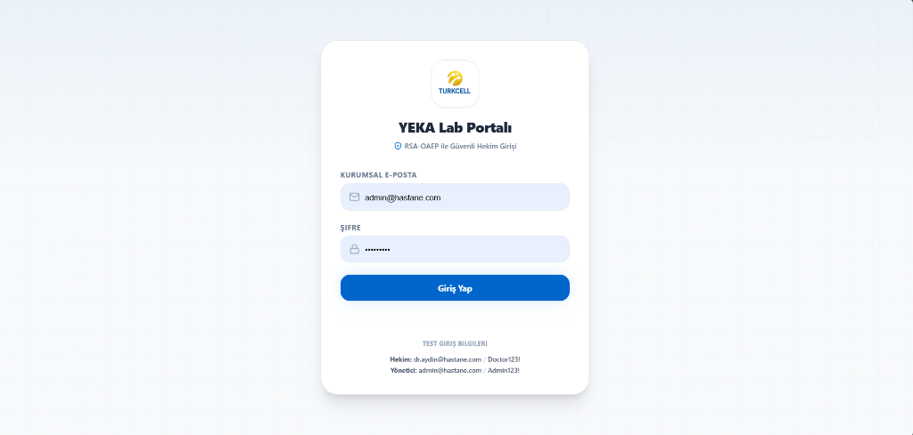
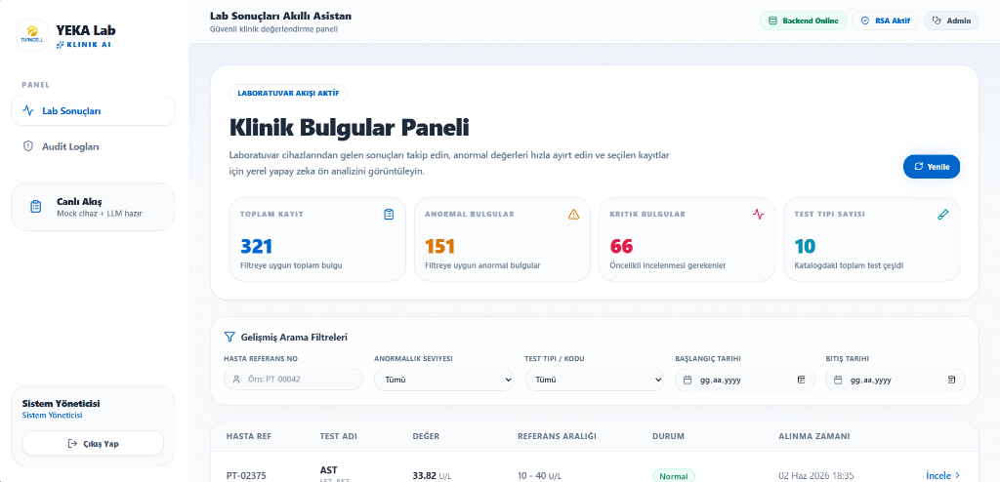
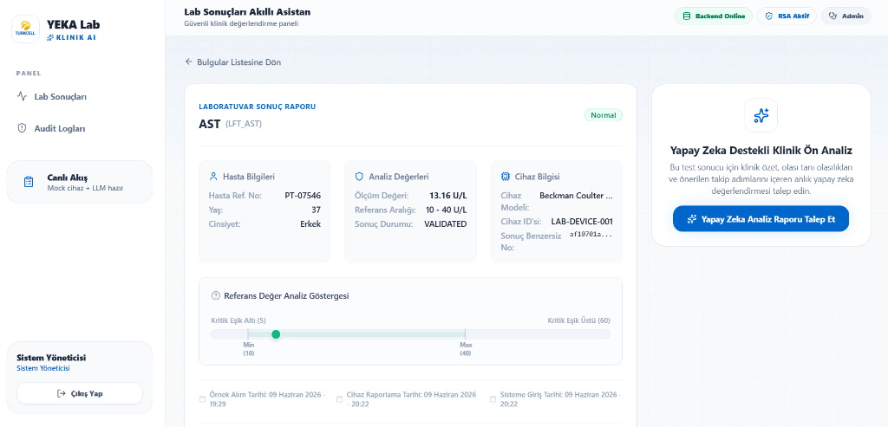
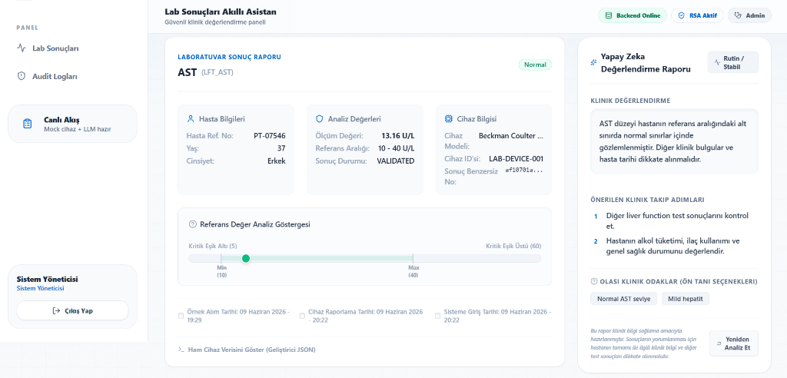
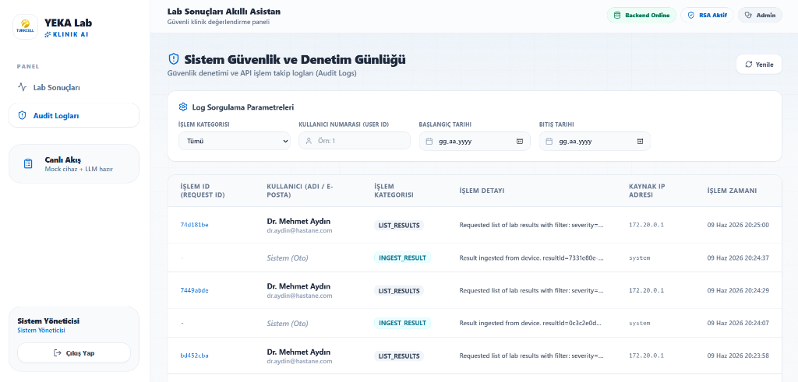

# YEKA Lab Portalı - Kullanım ve DeÄŸerlendirme Kılavuzu (USER GUIDE)

Bu kılavuz, **Lab Sonuçları Akıllı Asistanı** uygulamasının kurulum, kullanım ve değerlendirme adımlarını içermektedir.

---

## 1. Giriş ve Oturum Açma (Authentication)

Uygulama, hekimlerin ve yöneticilerin güvenli bir şekilde giriş yapabilmesi için uygulama katmanında **RSA-OAEP 2048-bit** asimetrik şifreleme kullanır.

*   **Hekim Yetkisi (DOCTOR):** `dr.aydin@hastane.com` / `Doctor123!`
*   **Yönetici Yetkisi (ADMIN):** `admin@hastane.com` / `Admin123!`

### Giriş Ekranı Görünümü
Aşağıdaki ekran görüntüsünde, asimetrik şifreleme ve kurumsal giriş formu yer almaktadır:



*Not: Şifreniz ağ üzerinden gönderilmeden önce tarayıcıda RSA public key ile şifrelenir ve backend tarafında private key ile çözülerek BCrypt doğrulaması gerçekleştirilir.*

---

## 2. Klinik Bulgular Paneli (Dashboard)

Başarılı bir şekilde giriş yapıldığında, sizi modern, Apple-tarzı açık temalı **Klinik Bulgular Paneli** karşılar:



### Panel BileÅŸenleri:
1.  **Global İstatistik Kartları:**
    *   **Toplam Kayıt:** Filtrelere uyan toplam kayıt sayısını gösterir.
    *   **Anormal Bulgular:** Filtrelere uyan tüm sayfalardaki anormal sonuçların toplam sayısıdır.
    *   **Kritik Bulgular:** Acil müdahale gerektiren (Kritik Düşük/Kritik Yüksek) sonuçların toplam sayısıdır.
    *   **Test Tipi Sayısı:** Sistemdeki benzersiz test çeşitliliğidir.
2.  **Gelişmiş Arama Filtreleri:** Hasta referans numarası, anormallik seviyesi, test kodu ve tarih aralığına göre anlık sorgulama yapabilirsiniz.
3.  **Sonuç Listesi ve Sayfalama:** Sonuçlar tablosunda her bir kaydın durumunu görebilir, sayfa değiştirerek veritabanında gezinebilirsiniz.

---

## 3. Mock Cihaz Senaryolarını Tetikleme

Sisteme farklı tipte verilerin (normal, anormal, kritik veya hatalı) aktığını görmek için `mock-lab-service` (port `8081`) simülasyonunu terminalden yönlendirebilirsiniz:

```bash
# Sıradaki test sonucunun 'KRİTİK' olmasını tetikleme:
curl -X POST http://localhost:8081/api/device/scenario/override \
     -H "Content-Type: application/json" \
     -d '{"scenario": "CRITICAL"}'
```

### Kullanılabilir Senaryolar ve Davranışları:
*   `NORMAL`: Referans aralıkları içinde normal bir test değeri üretir.
*   `ABNORMAL_LOW` / `ABNORMAL_HIGH`: Referans sınırlarının hafif dışında sonuç üretir.
*   `CRITICAL`: Hayati tehlike oluşturabilecek aşırı düşük veya yüksek değer üretir.
*   `MALFORMED`: Bozuk veri formatı simüle eder (Örn: Geçersiz yaş, negatif referans aralığı). Backend bu veriyi yakalar, `INVALID` statüsü ile veri tabanına yazar ancak paneli kirletmemesi için hekim tablosuna yansıtmaz.
*   `DEVICE_ERROR`: Cihazın kapalı olması durumudur. Cihaz 503 Service Unavailable döner. Backend polling servisi hata fırlatmadan gracefully log atarak çalışmaya devam eder.

---

## 4. Yapay Zeka (LLM) Analiz Raporu Ä°steme

1.  Bulgular listesinden herhangi bir hastanın sağ tarafındaki **"İncele >"** butonuna tıklayın.
2.  Açılan detay kartında, hastanın değerinin referans aralığında nerede olduğunu gösteren **Klinik Referans İndikatörünü** göreceksiniz. Farenizi indikatörün üzerindeki noktaya getirdiğinizde hastanın tam değeri bir mikro animasyon ile belirecektir.

### Analiz Öncesi Görünüm
Hekim detay kartına girdiğinde, sağ kısımda YZ Analiz Raporu talep edebileceği buton yer alır:



3.  Sağ tarafta yer alan **"Yapay Zeka Analiz Raporu Talep Et"** butonuna basın.
4.  Lokal GPU'nuzda çalışan **Ollama (qwen2.5:14b)** modeli, hastanın yaşını, cinsiyetini ve test değerlerini analiz ederek saniyeler içinde **Klinik Özet**, **Ön Tanı Seçenekleri**, **Önerilen Eylemler** ve aciliyet durumunu hekime raporlar.

### Analiz Sonrası Klinik Rapor
Saniyeler içinde Ollama modeli tarafından üretilen klinik değerlendirme ve öneriler hekim paneline yansır:



*Not: Eğer Ollama kapalıysa veya çökmüşse, sistem hekime hata vermek yerine kural tabanlı bir yedek rapor (Fallback Report) oluşturur ve Ollama servisinin offline olduğunu belirten bir uyarı paneli gösterir.*

---

## 5. Yönetici Denetim İzleri (Admin Audit Logs)

Bir `ADMIN` (`admin@hastane.com`) olarak giriş yaptığınızda, sol menüde **Audit Logları** seçeneği belirir. Bu sayfa, sistemde gerçekleştirilen her kritik işlemi ve kimin gerçekleştirdiğini loglar.



### Örnek Denetim Senaryosu:
Bir denetim uzmanı veya hastane yöneticisi sisteme sızma girişimi veya veri sızıntısı şüphesi ile inceleme yapmak istiyor:

1.  **Senaryo:** Yönetici `admin@hastane.com` hesabı ile giriş yapar ve **Audit Logları** sayfasına tıklar.
2.  **Arama:** Arama çubuğuna `VIEW_RESULT` yazar veya filtreleri kullanarak belirli bir hekimin (`dr.aydin@hastane.com`) yaptığı sorguları listeler.
3.  **Bulgular:**
    *   `LIST_RESULTS` logları ile hekimin hangi filtrelerle arama yaptığını gözlemler.
    *   `VIEW_RESULT` logları ile hekimin hangi hastaların (Örn: `PT-00042`) detay verilerini incelediğini görür.
    *   Loglardaki `requestId` değeri sayesinde, hekimin bir işlem yaparken oluşturduğu HTTP request zincirini takip ederek veritabanı sorgularını eşleştirir.
    *   `LOGIN_SUCCESS` veya `LOGIN_FAILURE` logları ile yetkisiz giriş denemelerini veya şüpheli IP adreslerini saptar.

Bu sayede hastane yönetimi, hasta verilerinin gizliliğini (KVKK / GDPR uyumluluğu) tam zamanlı olarak denetleyebilmektedir.
